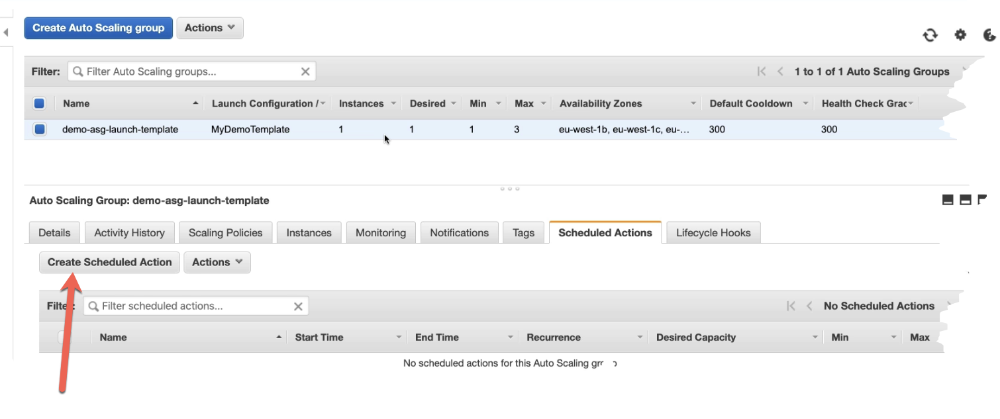

- Autoscaling group can be created in 2 ways
	- Method 1 - [[Launch-configuration]]
	- Method 2 - [[Launch-Templates]]
-
	- #+BEGIN_NOTE
	  If requirement to choose mix of ondemand and reserved instances to be created then go for [[Launch-Templates]] #exam-revise 
	  #+END_NOTE
- ASG-Scheduled Actions
	- To schedule scaling to scale up or down
	- [Getting started](https://docs.aws.amazon.com/autoscaling/ec2/userguide/ec2-auto-scaling-scheduled-scaling.html) #hands-on
	- {:height 261, :width 611}``
-
- ASG - Scaling Policies
	- To track any specific metric say: CPU utilisation and get ASG to scale up or down
	-
- [Attach ASG to loadbalancer](https://docs.aws.amazon.com/autoscaling/ec2/userguide/attach-load-balancer-asg.html) #hands-on
-
-