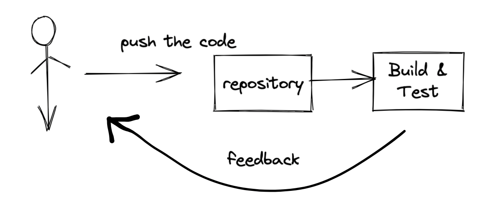

- #+BEGIN_QUOTE
  Study material for AWS devops professional. 
  I will add notes as  Day 1 , 2  .... so that when you refer the notes anytime you can take the timeline as reference !
  #+END_QUOTE
- ## Prerequiste
	- Minimum any one Associate level certificate
	- Pure hands-on and going to need practice , practice so let's get our hands dirty 😊
	- Get your AWS account created
	- Get your AWS CLI setup
- Day wise tracker
	- Day 1
		- ((6238bf86-e7cf-4b09-acb6-89a9bd9e1307))
	- Day 2
		- ((6238bf86-9de5-49b0-8f5f-ab6c7d976ced))
	- Day 3
		- ((6238bf86-0802-4806-b2c6-5a1e0500f084))
	- Day 4
		- ((623a275d-36c2-43eb-b2e5-6612da8ffd3b)) Practiced Hands-on and revised topic for Day 1 - 3
	- Day 5
		- ((6238bf86-06af-45c9-9724-cf8f40badcc2))
	- Day 6
		- ((6241f27e-2baa-4ed5-b069-efe8195f6dab))
	- Day 7
		- ((62434b14-d801-44a9-b621-c1582ce00474))
		- ((623f65b8-4fd2-44e9-bfb7-ff675907fa4c))
	- Day 8
		- Today we played with our hobby project -> way how we actually hosted our blog https://notes.techpechu.com to execute some commands over pipeline!
		- Nothing much but it was fun! Will continue tomorrow
	- Day 9
		- ((6245e567-55a5-4256-bcd3-2ccb2b8c1000))
		- ((6245ee0c-8e48-491d-a887-a68516a7ee01))
	- Day 10
		- ((625464bb-3dcd-4966-a004-f4d6e1c17a5c))
		- ((62546ca6-1ede-4a85-92ed-3002b8086fef))
	- Day 11
		- ((62546cb7-1f42-4604-bdda-a528e9158c5d))
		- ((62603ace-1b1c-466a-bbc2-837bf4da5b6d))
		- ((62604172-ac30-40b6-9d8e-0bb8bf942a22))
	- Day 12
		- ((6260428a-9aac-4c3f-8069-75b3b2f4ca9d))
		- ((6262f3ac-d270-4b4c-8fc4-27b22cfa615f))
		- ((6262f7c1-26da-4642-85c6-fd500d7f3120))
		- ((6262f52d-d0c0-46c4-bfa4-60b974ad8d8c))
		- ((6262fc6c-25ff-4837-a89a-977b9ac00f0a))
		- ((6262fe0a-bc48-45b4-8d4b-6b679861d4a3))
		- ((6262fe4c-7fee-4ba7-a86d-1aa530a60538))
	- Day 13
		- ((62654cac-9b49-4979-b94d-a91740b2aaf4))
		- ((62654dbd-6dc8-434b-84c6-e55edcfe3e37))
		- ((626552bc-e8fe-4dc2-9fbf-f84c9bbe7285))
		- ((62658a20-7361-480b-8ca9-6e3ff39f0a38))
		- ((62658a74-a528-4e00-ac1e-31567b5523f9))
		- ((62658b56-353e-4c46-8554-c45e45048e8f))
		- ((62658fca-7278-4637-9973-b7fc37bdf7ec))
		- ((62659057-f1c6-4807-b6e4-2705d1164e2f))
	- Day 14
		- ((62658aea-cb92-4e6b-804d-ee6e080eaf9a))
		- ((62683dd3-9460-4542-a42a-50a39ac2e365))
		- ((62658a93-b2a8-4dd2-bfcb-c81212da6d15))
		- ((62684062-9ff4-4028-9f2a-71e23f59b55e))
		- ((626552a8-4ec3-4dbf-82b5-26e2deb29c71))
	- Day 15
		- ((626979d5-5289-453e-8842-d8c4d9826a89))
		- ((62697fec-f25c-4878-ab5f-006771734c99))
		- ((62698281-572c-4909-b9fe-126080df5eed))
		- ((626988bc-80aa-4170-947f-721eb5bcb17b))
	- Day 16
		- <<Notes are not in detail as already covered in associate level cert preparation
		- [[ASG]]
		- [[S3]]
		- [[Multi-AZ]]
		- [[Multi-Region]]
		- [[Route53]]
		- [[DynamoDB]]
	- Day 17
		-
		-
		-
		-
- # Topic: SDLC Atomation
  collapsed:: true
	- ## CICD Overview
	  id:: 6238bf86-e7cf-4b09-acb6-89a9bd9e1307
	  collapsed:: true
		- ### Continuous Integration
		  collapsed:: true
			- 
		- ### Continuous Delivery vs Deployment
		  id:: 623f65b8-1902-4455-a1a3-09cfb8e46d7e
			- Continuous Delivery
				- When entire deployment till Production occurs with some manual intervention
			- Continuous Deployment
				- No manual intervention at all
		- ### Stacks to focus on
			- [[CodeCommit]]
			  id:: 6238bf86-9de5-49b0-8f5f-ab6c7d976ced
			- [[CodeBuild]]
			  id:: 6238bf86-0802-4806-b2c6-5a1e0500f084
			- [[CodePipeline]]
			  id:: 6241f27e-2baa-4ed5-b069-efe8195f6dab
			- [[CodeStar]]
			  id:: 62434b14-d801-44a9-b621-c1582ce00474
			- [[Elastic Beanstalk]]
			- [[CodeDeploy]]
			  id:: 6238bf86-06af-45c9-9724-cf8f40badcc2
			- [[Jenkins CI]]
			  id:: 623f65b8-4fd2-44e9-bfb7-ff675907fa4c
			- [[Cloudformation]]
		- TODO Whitepaters to read on
			- MUST READ - Blue/Green Deployments on AWS/   https://d1.awsstatic.com/whitepapers/AWS_Blue_Green_Deployments.pdf
			  RECOMMENDED - Practicing Continuous Integration Continuous Delivery on AWS
			      https://d1.awsstatic.com/whitepapers/DevOps/practicing-continuous-integration-continuous-delivery-on-AWS.pdf
			  RECOMMENDED - Jenkins on AWS
			      https://d1.awsstatic.com/whitepapers/DevOps/Jenkins_on_AWS.pdf
			  OPTIONAL - Introduction to DevOps on AWS
			      https://d1.awsstatic.com/whitepapers/AWS_DevOps.pdf
			  OPTIONAL - Development and Test on AWS
			      https://d1.awsstatic.com/whitepapers/aws-development-test-environments.pdf
		-
	- Reference links
	  collapsed:: true
		- CodeCommit
			- https://www.atlassian.com/git/tutorials/using-branches
			- https://docs.aws.amazon.com/codecommit/latest/userguide/auth-and-access-control-iam-identity-based-access-control.html
			- https://aws.amazon.com/blogs/devops/refining-access-to-branches-in-aws-codecommit/
			- https://docs.aws.amazon.com/codecommit/latest/userguide/how-to-notify.html
			- https://docs.aws.amazon.com/codecommit/latest/userguide/how-to-repository-email.html )
			- https://docs.aws.amazon.com/codecommit/latest/userguide/how-to-notify-lambda.html
			- https://docs.aws.amazon.com/codecommit/latest/userguide/how-to-migrate-repository-existing.html
		- CodeBuild
			- https://docs.aws.amazon.com/codebuild/latest/userguide/build-spec-ref.html
			- https://docs.aws.amazon.com/codebuild/latest/userguide/samples.html
			- https://docs.aws.amazon.com/codebuild/latest/userguide/sample-docker.html
			- https://aws.amazon.com/blogs/devops/validating-aws-codecommit-pull-requests-with-aws-codebuild-and-aws-lambda/
		- CodeDeploy
			- https://docs.aws.amazon.com/codedeploy/latest/APIReference/API_MinimumHealthyHosts.html
			- https://docs.aws.amazon.com/codedeploy/latest/userguide/reference-appspec-file-structure-hooks.html
			- https://docs.aws.amazon.com/codedeploy/latest/userguide/reference-appspec-file-structure-hooks.html#appspec-hooks-server
			- https://docs.amazonaws.cn/en_us/codedeploy/latest/userguide/reference-appspec-file-structure-hooks.html#reference-appspec-file-structure-environment-variable-availability
			- https://docs.aws.amazon.com/codedeploy/latest/userguide/monitoring-cloudwatch-events.html
			- https://aws.amazon.com/blogs/devops/view-aws-codedeploy-logs-in-amazon-cloudwatch-console/
			- https://docs.aws.amazon.com/codedeploy/latest/userguide/monitoring-sns-event-notifications.html
			- https://docs.aws.amazon.com/codedeploy/latest/userguide/deployments-rollback-and-redeploy.html
			- https://docs.aws.amazon.com/codedeploy/latest/userguide/deployment-groups-configure-advanced-options.html
			- https://docs.aws.amazon.com/codedeploy/latest/userguide/instances-on-premises.html
			- https://docs.aws.amazon.com/codedeploy/latest/userguide/register-on-premises-instance-iam-user-arn.html
			- https://docs.aws.amazon.com/codedeploy/latest/userguide/register-on-premises-instance-iam-session-arn.html
			- https://docs.aws.amazon.com/codedeploy/latest/userguide/deployment-configurations.html#deployment-configuration-lambda
			- https://docs.aws.amazon.com/codedeploy/latest/userguide/reference-appspec-file-structure-hooks.html#appspec-hooks-lambda
		- CodePipeline
			- https://docs.aws.amazon.com/codepipeline/latest/userguide/reference-pipeline-structure.html#action-requirements
			- https://docs.aws.amazon.com/codepipeline/latest/userguide/best-practices.html#use-cases
			- https://docs.aws.amazon.com/codepipeline/latest/userguide/actions-invoke-lambda-function.html
			- https://docs.aws.amazon.com/codepipeline/latest/userguide/actions-create-custom-action.html
			- https://docs.aws.amazon.com/codepipeline/latest/APIReference/API_PutJobSuccessResult.html
			- https://docs.aws.amazon.com/AWSCloudFormation/latest/UserGuide/continuous-delivery-codepipeline.html
			- https://docs.aws.amazon.com/codepipeline/latest/userguide/tutorials-cloudformation.html
			- https://github.com/aws-samples/codepipeline-nested-cfn
			- https://aws.amazon.com/blogs/devops/implementing-gitflow-using-aws-codepipeline-aws-codecommit-aws-codebuild-and-aws-codedeploy/
		- CodeStar
			- https://docs.aws.amazon.com/codestar/latest/userguide/templates.html
		- Jenkins
			- https://aws.amazon.com/getting-started/projects/setup-jenkins-build-server/
			- https://wiki.jenkins.io/display/JENKINS/Amazon+EC2+Plugin
			- https://aws.amazon.com/blogs/devops/setting-up-a-ci-cd-pipeline-by-integrating-jenkins-with-aws-codebuild-and-aws-codedeploy/
			- https://wiki.jenkins.io/display/JENKINS/AWS+CodeBuild+Plugin
			- https://wiki.jenkins.io/display/JENKINS/Amazon+EC2+Container+Service+Plugin
			- https://wiki.jenkins.io/display/JENKINS/Artifact+Manager+S3+Plugin
			- https://wiki.jenkins.io/display/JENKINS/AWS+CodePipeline+Plugin
- # Topic : Monitoring and Logging
  collapsed:: true
	- [[CloudTrail]]
	  id:: 6245e567-55a5-4256-bcd3-2ccb2b8c1000
	- [[Kinesis]]
	  id:: 6245ee0c-8e48-491d-a887-a68516a7ee01
	- [[Cloudwatch Metrics]]
	  id:: 625464bb-3dcd-4966-a004-f4d6e1c17a5c
	- [[Cloudwatch Alarm]]
	  id:: 62546ca6-1ede-4a85-92ed-3002b8086fef
	- [[Cloudwatch Logs]]
	  id:: 62546cb7-1f42-4604-bdda-a528e9158c5d
	- [[Cloudwatch unified agent]]
	  id:: 62603ace-1b1c-466a-bbc2-837bf4da5b6d
	- [[Cloudwatch Metric filters and alarm]]
	  id:: 62604172-ac30-40b6-9d8e-0bb8bf942a22
	- [[Cloudwatch logs export to S3]]
	  id:: 6260428a-9aac-4c3f-8069-75b3b2f4ca9d
	- [[Logs]]
	  id:: 6262f3ac-d270-4b4c-8fc4-27b22cfa615f
	- [[CloudWatch events]]
	  id:: 6262f52d-d0c0-46c4-bfa4-60b974ad8d8c
	- [[S3 events]]
	  id:: 6262f7c1-26da-4642-85c6-fd500d7f3120
	- [[Cloudwatch dashboard]]
	  id:: 6262fc6c-25ff-4837-a89a-977b9ac00f0a
	- [[X-ray]]
	  id:: 6262fe0a-bc48-45b4-8d4b-6b679861d4a3
	- [[ElasticSearch (ES)]]
	  id:: 6262fe4c-7fee-4ba7-a86d-1aa530a60538
	- AWS Tag strategies [Refer - here](https://docs.aws.amazon.com/general/latest/gr/aws_tagging.html)
	  id:: 62654cac-9b49-4979-b94d-a91740b2aaf4
	- Reference links
	  collapsed:: true
		- CloudTrail:
		- https://docs.aws.amazon.com/awscloudtrail/latest/userguide/cloudtrail-log-file-validation-cli.html
		- https://docs.aws.amazon.com/awscloudtrail/latest/userguide/cloudtrail-receive-logs-from-multiple-accounts.html
		- https://docs.aws.amazon.com/awscloudtrail/latest/userguide/cloudtrail-sharing-logs.html
		- CloudWatch:
		- https://docs.aws.amazon.com/AmazonCloudWatch/latest/monitoring/cloudwatch_concepts.html#Metric
		- https://docs.aws.amazon.com/AmazonCloudWatch/latest/monitoring/metrics-collected-by-CloudWatch-agent.html#linux-metrics-enabled-by-CloudWatch-agent
		- https://docs.aws.amazon.com/AmazonCloudWatch/latest/logs/Counting404Responses.html
		- https://docs.aws.amazon.com/AmazonCloudWatch/latest/logs/Subscriptions.html
		- https://aws.amazon.com/blogs/big-data/power-data-ingestion-into-splunk-using-amazon-kinesis-data-firehose/
		- https://docs.aws.amazon.com/AmazonCloudWatch/latest/logs/SubscriptionFilters.html#FirehoseExample
		- https://docs.aws.amazon.com/AmazonCloudWatch/latest/events/Create-CloudWatch-Events-CloudTrail-Rule.html
		- https://docs.aws.amazon.com/AmazonS3/latest/user-guide/enable-event-notifications.html
		- X-Ray:
		- https://docs.aws.amazon.com/xray/latest/devguide/aws-xray.html
		- https://aws.amazon.com/blogs/devops/using-amazon-cloudwatch-and-amazon-sns-to-notify-when-aws-x-ray-detects-elevated-levels-of-latency-errors-and-faults-in-your-application/
		- Amazon ES:
		- https://docs.aws.amazon.com/AmazonCloudWatch/latest/logs/CWL_ES_Stream.html
		- Tagging in AWS
		- https://aws.amazon.com/answers/account-management/aws-tagging-strategies/
- # Topic : Policies and Standard Automation
	- [[SSM]]
	  id:: 62654dbd-6dc8-434b-84c6-e55edcfe3e37
	- [[SSM - Resource groups]]
	  id:: 626552bc-e8fe-4dc2-9fbf-f84c9bbe7285
	- [[SSM - Run Command]]
	  id:: 62658a20-7361-480b-8ca9-6e3ff39f0a38
	- [[SSM - Parameter store]]
	  id:: 62658a74-a528-4e00-ac1e-31567b5523f9
	- [[SSM - Patch Manager]]
	  id:: 62658b56-353e-4c46-8554-c45e45048e8f
	- [[SSM - Inventory]]
	  id:: 62658fca-7278-4637-9973-b7fc37bdf7ec
	- [[SSM -automations]]
	  id:: 62659057-f1c6-4807-b6e4-2705d1164e2f
	- [[Config]]
	  id:: 62658aea-cb92-4e6b-804d-ee6e080eaf9a
	- [[Service Catalog]]
	  id:: 62683dd3-9460-4542-a42a-50a39ac2e365
	- [[Amazon Inspector]]
	  id:: 62658a93-b2a8-4dd2-bfcb-c81212da6d15
	- [[Cost allocation tags]]
	  id:: 62684062-9ff4-4028-9f2a-71e23f59b55e
	- [[License Manager]]
	  id:: 626552a8-4ec3-4dbf-82b5-26e2deb29c71
	- [[Secrets Manager]]
	  id:: 626979d5-5289-453e-8842-d8c4d9826a89
	- [[Service Health Dashboard]]
	  id:: 62697fec-f25c-4878-ab5f-006771734c99
	- [[Trusted Advisor]]
	  id:: 62698281-572c-4909-b9fe-126080df5eed
	- [[GuardDuty]]
	- [[Macie]]
	  id:: 626988bc-80aa-4170-947f-721eb5bcb17b
	- Reference links
	  collapsed:: true
		- AWS Systems Manager
		  collapsed:: true
			- https://docs.aws.amazon.com/systems-manager/latest/userguide/systems-manager-managedinstances.html
			- https://docs.aws.amazon.com/systems-manager/latest/userguide/activations.html
			- https://docs.aws.amazon.com/systems-manager/latest/userguide/patch-manager-approved-rejected-package-name-formats.html
			- https://docs.aws.amazon.com/systems-manager/latest/userguide/systems-manager-automation.html
			- https://docs.aws.amazon.com/systems-manager/latest/userguide/automation-walk-patch-linux-ami-console.html
			- https://docs.aws.amazon.com/systems-manager/latest/userguide/automation-cf.html
			- https://d1.awsstatic.com/whitepapers/aws-building-ami-factory-process-using-ec2-ssm-marketplace-and-service-catalog.pdf
			- https://github.com/miztiik/AWS-Demos/tree/master/How-To/setup-ami-lifecycle-management-using-ssm
		- AWS Config
		  collapsed:: true
			- https://docs.aws.amazon.com/config/latest/developerguide/s3-bucket-policy.html
			- https://aws.amazon.com/about-aws/whats-new/2019/03/use-aws-config-to-remediate-noncompliant-resources/)
			- https://aws.amazon.com/about-aws/whats-new/2018/03/aws-config-notifications-are-now-integrated-with-amazon-cloudwatch-events/
			- https://docs.aws.amazon.com/config/latest/developerguide/monitor-config-with-cloudwatchevents.html
			- https://docs.aws.amazon.com/config/latest/developerguide/notifications-for-AWS-Config.html
			- https://docs.aws.amazon.com/config/latest/developerguide/aggregate-data.html
		- AWS Inspector
			- https://aws.amazon.com/about-aws/whats-new/2017/07/amazon-inspector-adds-event-triggers-to-automatically-run-assessments/
			- https://aws.amazon.com/blogs/security/how-to-remediate-amazon-inspector-security-findings-automatically/
			- https://aws.amazon.com/blogs/security/how-to-set-up-continuous-golden-ami-vulnerability-assessments-with-amazon-inspector/
			- https://d1.awsstatic.com/whitepapers/aws-building-ami-factory-process-using-ec2-ssm-marketplace-and-service-catalog.pdf
			- https://aws.amazon.com/blogs/awsmarketplace/announcing-the-golden-ami-pipeline
		- AWS Health
			- https://status.aws.amazon.com/
			- https://github.com/aws/aws-health-tools/tree/master/automated-actions/AWS_RISK_CREDENTIALS_EXPOSED
			- AWS Trusted Advisor
			- https://docs.aws.amazon.com/awssupport/latest/user/cloudwatch-events-ta.html
			- https://github.com/aws/Trusted-Advisor-Tools
			- https://github.com/aws/Trusted-Advisor-Tools/tree/master/ExposedAccessKeys
			- https://github.com/aws/Trusted-Advisor-Tools/tree/master/HighUtilizationEC2Instances
			- https://docs.aws.amazon.com/awssupport/latest/user/cloudwatch-metrics-ta.html
			- https://aws.amazon.com/premiumsupport/technology/trusted-advisor/
			- https://docs.aws.amazon.com/cli/latest/reference/support/index.html#cli-aws-support
		- AWS Macie
			- https://aws.amazon.com/blogs/security/classify-sensitive-data-in-your-environment-using-amazon-macie/
-
- # Topic : Incident , Fault Tolerance, DR
	- #+BEGIN_NOTE
	  This section you would have seen in detail on associate certificates hence not that dense notes  in place.
	  #+END_NOTE
	- [[ASG]]
	- [[S3]]
	- [[Multi-AZ]]
	- [[Multi-Region]]
	- [[Route53]]
	- [[DynamoDB]]
	- Reference links
	  collapsed:: true
		- Auto Scaling
			- https://gist.github.com/mikepfeiffer/d27f5c478bef92e8aff4241154b77e54
			- https://aws.amazon.com/about-aws/whats-new/2018/05/application-load-balancer-announces-slow-start-support/
			- http://docs.aws.amazon.com/autoscaling/latest/userguide/as-suspend-resume-processes.html
			- https://docs.aws.amazon.com/autoscaling/ec2/userguide/lifecycle-hooks.html
			- https://github.com/aws-samples/aws-lambda-lifecycle-hooks-function
			- https://docs.aws.amazon.com/autoscaling/ec2/userguide/as-instance-termination.html
			- https://aws.amazon.com/about-aws/whats-new/2015/12/protect-instances-from-termination-by-auto-scaling/
			- https://aws.amazon.com/blogs/devops/use-a-creationpolicy-to-wait-for-on-instance-configurations/
			- https://docs.aws.amazon.com/AWSCloudFormation/latest/UserGuide/aws-attribute-updatepolicy.html
			- https://aws.amazon.com/premiumsupport/knowledge-center/auto-scaling-group-rolling-updates/
			- https://docs.aws.amazon.com/codedeploy/latest/userguide/tutorials-auto-scaling-group-create-deployment.html
			- https://docs.aws.amazon.com/codedeploy/latest/userguide/integrations-aws-auto-scaling.html
			- https://d1.awsstatic.com/whitepapers/AWS_Blue_Green_Deployments.pdf
		- DynamoDB
			- https://aws.amazon.com/blogs/database/choosing-the-right-dynamodb-partition-key/
			- https://docs.aws.amazon.com/amazondynamodb/latest/developerguide/AppendixSampleTables.html#AppendixSampleData.Thread
			- https://docs.aws.amazon.com/amazondynamodb/latest/developerguide/Streams.html#Streams.Processing
			- https://docs.aws.amazon.com/amazondynamodb/latest/developerguide/time-to-live-ttl-how-to.html
			- https://aws.amazon.com/blogs/big-data/building-and-maintaining-an-amazon-s3-metadata-index-without-servers/
		- Multi-AZ
			- https://docs.aws.amazon.com/AWSEC2/latest/UserGuide/EBSEncryption.html
		- Multi-Region
			- https://docs.aws.amazon.com/config/latest/developerguide/aggregate-data.html
			- https://docs.aws.amazon.com/AWSCloudFormation/latest/UserGuide/stacksets-getting-started.html
			- https://docs.aws.amazon.com/AWSCloudFormation/latest/UserGuide/stacksets-prereqs.html
			- https://docs.aws.amazon.com/codepipeline/latest/userguide/actions-create-cross-region.html
			- https://aws.amazon.com/blogs/devops/using-aws-codepipeline-to-perform-multi-region-deployments/
		- Disaster Recovery
			- https://docs.aws.amazon.com/efs/latest/ug/efs-backup-solutions.html
			- https://docs.aws.amazon.com/Route53/latest/DeveloperGuide/hosted-zones-migrating.html
			- https://stackoverflow.com/questions/20337749/exporting-dns-zonefile-from-amazon-route-53
			- https://docs.aws.amazon.com/elasticbeanstalk/latest/dg/environment-configuration-methods-before.html#configuration-options-before-savedconfig
			- https://docs.aws.amazon.com/elasticbeanstalk/latest/dg/environment-configuration-savedconfig.html
		- On-Premise
			- https://docs.aws.amazon.com/AWSEC2/latest/UserGuide/amazon-linux-2-virtual-machine.html
			- https://aws.amazon.com/application-discovery/
		- Multi-Account
			- https://docs.aws.amazon.com/AmazonCloudWatch/latest/logs/CrossAccountSubscriptions.html
			- https://docs.aws.amazon.com/AmazonCloudWatch/latest/logs/CreateDestination.html
			- https://aws.amazon.com/premiumsupport/knowledge-center/streaming-cloudwatch-logs/
			- https://aws.amazon.com/blogs/architecture/stream-amazon-cloudwatch-logs-to-a-centralized-account-for-audit-and-analysis/
			- https://aws.amazon.com/blogs/architecture/stream-amazon-cloudwatch-logs-to-a-centralized-account-for-audit-and-analysis/
			- https://aws.amazon.com/premiumsupport/knowledge-center/streaming-cloudwatch-logs/
			- https://aws.amazon.com/about-aws/whats-new/2017/06/cloudwatch-events-adds-cross-account-event-delivery-support/
			- https://docs.aws.amazon.com/AmazonCloudWatch/latest/events/CloudWatchEvents-CrossAccountEventDelivery.html
	-
	- # Topic : Config management , IaC
		- [[Cloudformation]]
		- Reference links
		  collapsed:: true
			- CloudFormation:
			- https://stackoverflow.com/a/45007029/3019499
			- https://docs.aws.amazon.com/AWSCloudFormation/latest/UserGuide/walkthrough-custom-resources-lambda-lookup-amiids.html
			- https://github.com/awslabs/aws-cloudformation-templates/tree/master/aws/solutions/lambda-backed-cloudformation-custom-resources/Fetch-AMI-From-Parameter-Store
			- https://docs.aws.amazon.com/AWSCloudFormation/latest/UserGuide/using-cfn-describing-stacks.html#w2ab1c15c15c17c11
			- https://docs.aws.amazon.com/AWSCloudFormation/latest/UserGuide/troubleshooting.html#troubleshooting-errors-update-rollback-failed
			- https://aws.amazon.com/blogs/devops/continue-rolling-back-an-update-for-aws-cloudformation-stacks-in-the-update_rollback_failed-state/
			- https://stackoverflow.com/a/41468341/3019499
			- https://docs.aws.amazon.com/AWSCloudFormation/latest/APIReference/API_CreateStack.html#API_CreateStack_RequestParameters
			- https://docs.aws.amazon.com/AWSCloudFormation/latest/UserGuide/using-iam-template.html#using-iam-capabilities
			- https://docs.aws.amazon.com/AWSCloudFormation/latest/UserGuide/protect-stack-resources.html
			- Beanstalk
			- https://github.com/aws/aws-elastic-beanstalk-cli-setup
			- https://docs.aws.amazon.com/elasticbeanstalk/latest/dg/eb-cli3-install-advanced.html
			- https://aws.amazon.com/blogs/devops/using-the-elastic-beanstalk-eb-cli-to-create-manage-and-share-environment-configuration/
			- https://docs.aws.amazon.com/elasticbeanstalk/latest/dg/command-options-general.html#command-options-general-autoscalingasg
			- https://docs.aws.amazon.com/elasticbeanstalk/latest/dg/ebextensions-optionsettings.html
			- https://docs.aws.amazon.com/elasticbeanstalk/latest/dg/environment-resources.html
			- https://stackoverflow.com/a/40096352/3019499
			- https://docs.aws.amazon.com/elasticbeanstalk/latest/dg/create_deploy_docker_v2config.html
			- Lambda:
			- https://docs.aws.amazon.com/serverless-application-model/latest/developerguide/serverless-sam-cli-install.html
			- https://docs.aws.amazon.com/serverless-application-model/latest/developerguide/automating-updates-to-serverless-apps.html
			- Step Functions
			- https://aws.amazon.com/step-functions/use-cases/
			- API Gateway
			- https://aws.amazon.com/blogs/compute/introducing-amazon-api-gateway-private-endpoints/
			- https://docs.aws.amazon.com/apigateway/latest/developerguide/api-gateway-request-throttling.html
			- https://docs.aws.amazon.com/step-functions/latest/dg/tutorial-api-gateway.html
			- ECS
			- https://docs.aws.amazon.com/AmazonECS/latest/developerguide/service-auto-scaling.html
			- https://docs.aws.amazon.com/AmazonECS/latest/developerguide/using_awslogs.html
			- https://docs.aws.amazon.com/AmazonECS/latest/developerguide/using_cloudwatch_logs.html
			- https://ecsworkshop.com/introduction/cicd/
			- https://docs.aws.amazon.com/AmazonECS/latest/developerguide/ecs-cd-pipeline.html
			- https://docs.aws.amazon.com/codepipeline/latest/userguide/tutorials-ecs-ecr-codedeploy.html
			- https://aws.amazon.com/blogs/devops/build-a-continuous-delivery-pipeline-for-your-container-images-with-amazon-ecr-as-source/
			- Opsworks
			- https://docs.aws.amazon.com/opsworks/latest/userguide/welcome_classic.html
			- https://docs.aws.amazon.com/opsworks/latest/userguide/workingcookbook-events.html
			- https://docs.aws.amazon.com/opsworks/latest/userguide/workingcookbook-json.html
-