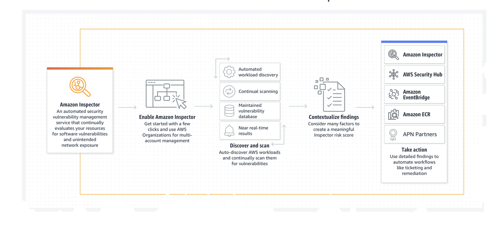

- Amazon inspector helps to identify any potential security issues
- Assessment setup
	- Network assessments
		- Inspector agent is not required
	- Host assessments
		- Inspector agent is  required
- How it works?
	- 
	- source: https://aws.amazon.com/inspector/
- /link
-