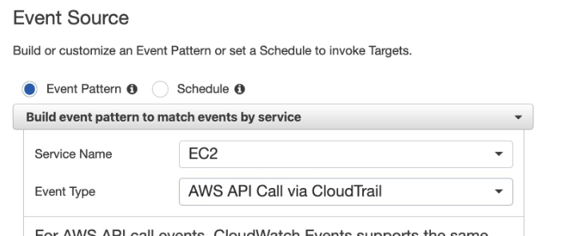

- #+BEGIN_NOTE
  Cloudwatch events and event bridge are quite similar and does the same purpose
  #+END_NOTE
- Ways to Trigger Events #exam-revise
	- You can Schedule an even to trigger using cron
	- You can trigger based on Event pattern
- We can also trigger Event mapping to specific api call via Cloudtrail
	- {:height 262, :width 655}
- Targets:
	- Thats where you say what action / service to be called when the event is triggered