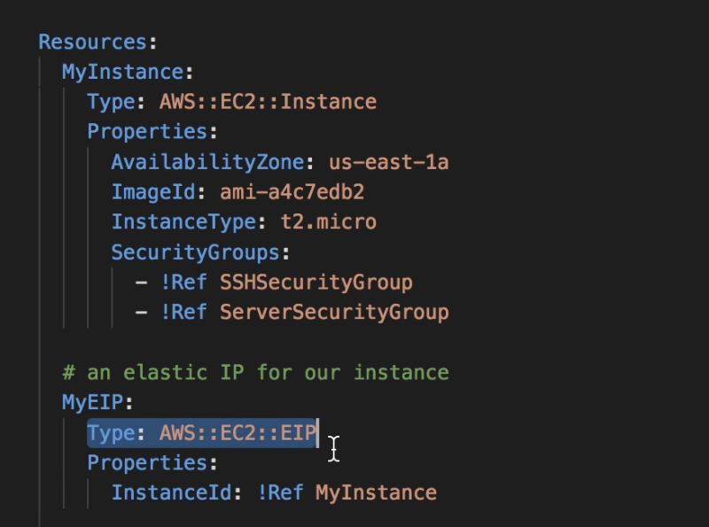
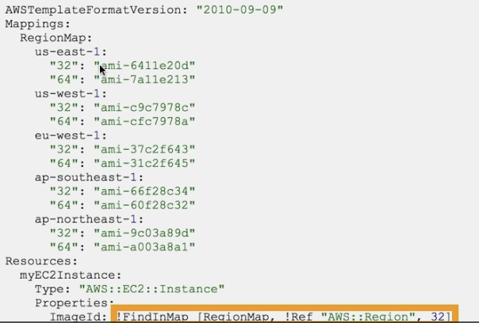
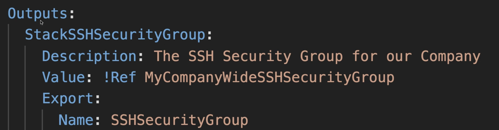
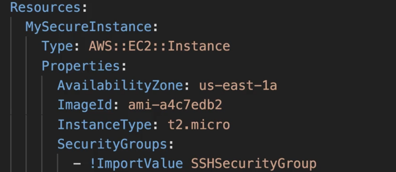
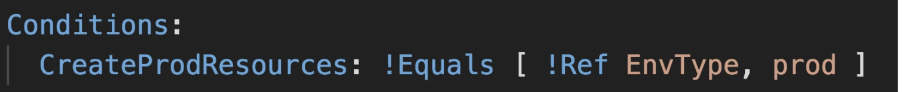
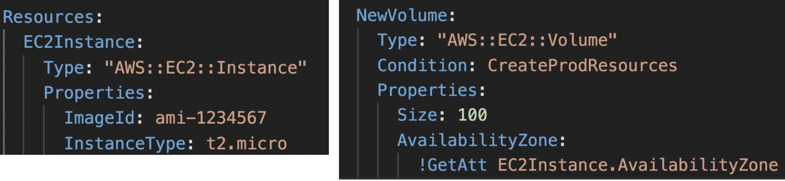
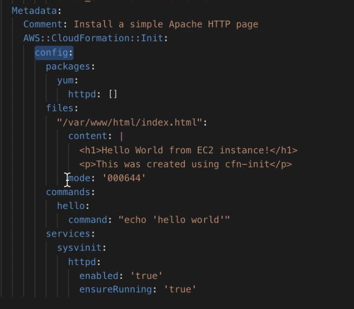
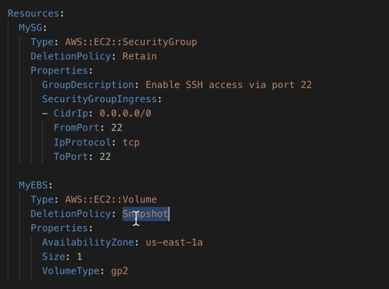
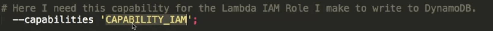

- Iac service
- YAML or JSON
- No additional cost for cloudformation
- Cloudformation handles the order of deployment and know the dependancies
- Components of Cloudformation
	- Stack
	  collapsed:: true
		- A set of resource that you can provision, update or delete
	- Templates
	  collapsed:: true
		- JSON or YAML file where you describes the resources that to be created
	- Components in Templates
	  collapsed:: true
		- Resources (mandatoy) : aws resource declared
		  collapsed:: true
			- #+BEGIN_NOTE
			  You can't create dynamic amount of resurces, everything to be declared
			  #+END_NOTE
			- 
		- Parameters : To pass dynamic inputs
		  collapsed:: true
			- To refer a parameter  `Fn::Ref` shorhand in YAML is !Ref
			- 
			- 
			- pseudo parameters
				- To get info like AWS account number , region etc these are inbuilt parameters
		- Mappings : static variable for your template
		  collapsed:: true
			- All values are harcoded within the template
			- To access `Fn::FindInMap` in short !FindInMap[ MapName , TopLevelKEy, SeconLeavelKey]
			- 
		- Outputs: to output details of resource created
		  collapsed:: true
			- To output values like VPC ID , subnetID
			- 
			- Cross stack Reference
				- To use output in abother stack `Fn::ImportValue` in short `!ImportValue`
				- 
		- Conditionals : Conditions to perform on resource creation
		  collapsed:: true
			- 
		- Metadata
	- Stack set
	  collapsed:: true
		- Allows you to update delete or create your stacks across a number of AWS accounts in different regions with a single template
		- You select the Template and which regions
		- #+BEGIN_IMPORTANT
		  In order to delete the stack set you need to ensure to delete all the stack instances in it
		  #+END_IMPORTANT
	- Stack instances
	  collapsed:: true
		- Each individual stacks created under stackset on multi regions are called as stack instances
	- Intrinsic Functions
	  collapsed:: true
		- Ref
			- To refer the parameters
			- `!Ref` is YAML shorrthand
		- Fn::GetAtt
			- To get any specific attribute info on the
			- 
		- Fn::FindInMap
		- Fn::ImportValue
		- Fn::Join
			- To join with a delimiter
		- Fn::Sub
			- To substitute one value with another
		- Condition Functions )Fn::If, Fn::Not, Fn::Equals,Fn::And, Fn::Or)
	- Userdata
	  collapsed:: true
		- Entire script to be passed in `Fn::Base64`
		- User data script log is storred in `/var/log/cloud-init-output.log`
		- 
	- Rollback
	  collapsed:: true
		- Default onfailure = rollback
		- to troubleshoot on failure = do_nothing
		- delete : onfailure = delet e
	- Changesets
	  collapsed:: true
		- Changesets will say what will be changed on updating the template
		- It can't say will the update will be succeed or not
	- Deletion policy
	  collapsed:: true
		- DeletionPolicy = Delete
			- Policy to say what happens to resources when the cloudformation template is deleted
			- by default for DB cluster default policy is Snapshot
			- To delete any S3 the bucket must be empty
			- #+BEGIN_NOTE
			  Default option is Delete , all resources will be deleted
			  #+END_NOTE
		- DeletionPolicy = Retain
			- preserve the resources on case of template deletion
		- DeletionPolicy = Snapshot
			- All data will be backedup
		- 
	- Termination policy
	- Depends-on
	  collapsed:: true
		- {:height 389, :width 578}
	- capability_iam
	  collapsed:: true
		- If one reasource needs IAM to access another resource , eg: stack to access another stack then use below
		- 
		- if not you will get `InsufficientCapabilitiesException`
	- cfn-wait
	  collapsed:: true
		- You can use a wait condition for situations like the following:
		- To coordinate stack resource creation with configuration actions that are external to the stack creation.
		- To track the status of a configuration process.
		- Ref:
			- https://docs.aws.amazon.com/AWSCloudFormation/latest/UserGuide/aws-properties-waitcondition.html
	- Nesed stack
	  collapsed:: true
		- Here you manage just the master stack and that has dependancy on other stack.
		- Tha master stack reads the child stack and populates the data in master stack
	- custom resources
		-
	-
	-
- Stack policy
	- Protects the existing resources to be unaffected from the any change on cloudformation
- How Cloudforation works?
  collapsed:: true
	- Upload the tempates to S3 and referred in the cloudformation
	- You can't redit the uploaded stack , you need to reupload
	- Stacks are identified by name
	- Deleting stack will delete every resources created by it