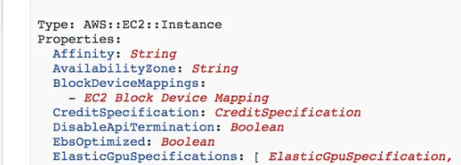
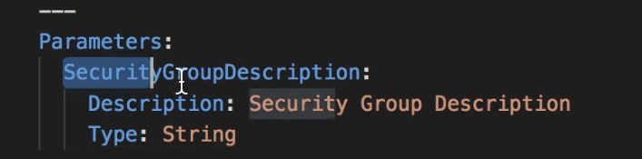
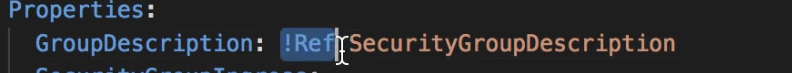

- Iac service
- YAML or JSON
- No additional cost for cloudformation
- Cloudformation handles the order of deployment and know the dependancies
- Components of Cloudformation
	- Stack
		- A set of resource that you can provision, update or delete
	- Templates
		- JSON or YAML file where you describes the resources that to be created
	- Components in Templates
		- Resources (mandatoy) : aws resource declared
			- 
		- Parameters : To pass dynamic inputs
		  collapsed:: true
			- To refer a parameter  `Fn::Ref` shorhand in YAML is !Ref
			- 
			- 
			- pseudo parameters
				- To get info like AWS account number , region etc these are inbuilt parameters
		- Mappings : static variable for your template
		- Outputs: to output details of resource created
		- Conditionals : Conditions to perform on resource creation
		- Metadata
		- Cn
	- Stack set
		- Allows you to update delete or create your stacks across a number of AWS accounts in different regions with a single template
		- You select the Template and which regions
		- #+BEGIN_IMPORTANT
		  In order to delete the stack set you need to ensure to delete all the stack instances in it
		  #+END_IMPORTANT
	- Stack instances
		- Each individual stacks created under stackset on multi regions are called as stack instances
	-
- Stack policy
  collapsed:: true
	- Protects the existing resources to be unaffected from the any change on cloudformation
- How Cloudforation works?
  collapsed:: true
	- Upload the tempates to S3 and referred in the cloudformation
	- You can't redit the uploaded stack , you need to reupload
	- Stacks are identified by name
	- Deleting stack will delete every resources created by it