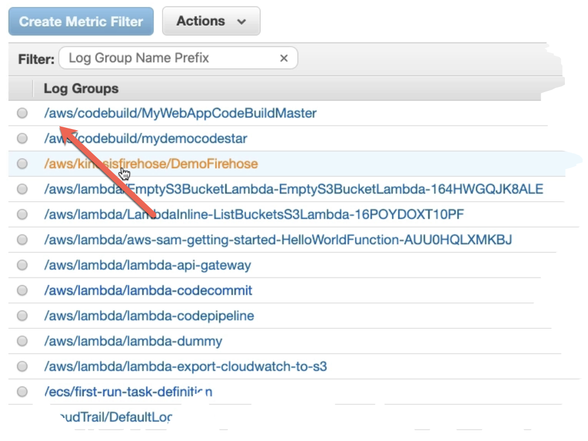

- Log groups - It's a directory that contains log streams #exam-revise
- Log streams - Contains Log itself #exam-revise
- Few logs are managed by aws itself those are prefixed by aws init
	- {:height 296, :width 415}
- expires events after
	- Logs expir