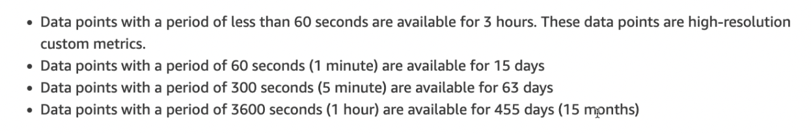

- Metrics provides info on various services.
- eg: CPU utilisation on EC2
- Basic monitoring - for every 5 min (free)
- Detailed monitoring - can get every 1 min (need to pay for it)
- We can get up **15 months ** of logs in cloudwatch #exam-revise
- Metric retention #exam-revise
	- 
	-
	-