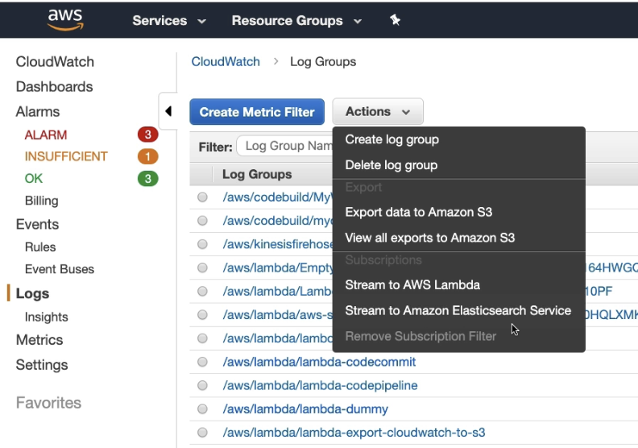

- Method 1:
	- For one time you can get it exported manually [hands-on guide](https://docs.aws.amazon.com/AmazonCloudWatch/latest/logs/S3ExportTasksConsole.html) #hands-on
- Method 2:
	- Wrtie a Lambda code to use method 1 api
	- Use Cloudwatch events to trigger Lambda and get the logs exported
- 