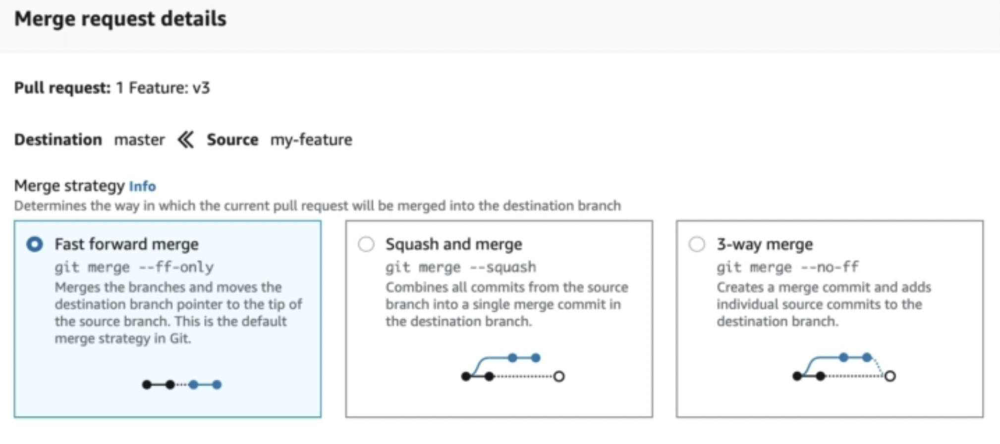

- Overview
	- It's a private repository
	- Infinite storage space
	- Files inside repositories can be encrypted
	- Can be integrated with any pipeline tools like Jenkins
- #+BEGIN_WARNING
  Don't use root account to create ssh , always use non-root account
  #+END_WARNING
- Credential creation for Code Commit ->  [AWS Reference](https://docs.aws.amazon.com/codecommit/latest/userguide/setting-up-ssh-unixes.html) #hands-on
- Clone, Add , Commit , Push
	- Commands remains same as git : Refer -> [Basic Git commands](https://www.atlassian.com/git/glossary)
- Merging Strategies #exam-revise
  collapsed:: true
	- 
	-
- Protect Master branch from unwanted commits #exam-revise
  collapsed:: true
	- To protect people from directly pushing changes to Master branch , we can restrict it with IAM policy [Guide to create IAM policy](https://docs.aws.amazon.com/codecommit/latest/userguide/how-to-conditional-branch.html) #hands-on
- Triggers and Notifications
	- Code Commit supports both Triggers and Notifications
	- Notifications - are referred to [[SNS]]
	- Triggers - can be referred to [[SNS]] and [[Lambda]]
- [[Cloudwatch events]]
	- We can setup cloudwatch events configured based on Code Commit and can trigger multiple components like [[Lambda]] [[SNS]]
	- [AWS guide](https://docs.aws.amazon.com/codepipeline/latest/userguide/pipelines-trigger-source-repo-changes-console.html)
-