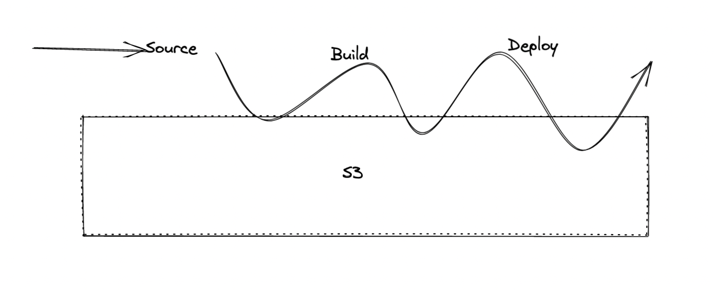

- It is a Continuous delivery
- Recall : ((623f65b8-1902-4455-a1a3-09cfb8e46d7e))
- It is made of stages
- #+BEGIN_TIP
  - Each stage can perform various actions like Test, Build , Deploy or any
  #+END_TIP
- CodePipeline is to orchestrate entire CICD
- 
- #+BEGIN_NOTE
  Each stage in pipeline can create [[Artifacts]] 
  #+END_NOTE
- Flow
	- 
	-