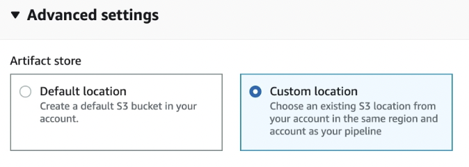
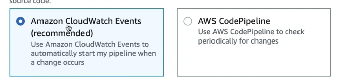

- It is a Continuous delivery
- Recall : ((623f65b8-1902-4455-a1a3-09cfb8e46d7e))
- It is made of stages
- #+BEGIN_TIP
  - Each stage can perform various actions like Test, Build , Deploy or any
  #+END_TIP
- CodePipeline is to orchestrate entire CICD
- 
- #+BEGIN_NOTE
  Each stage in pipeline can create [[Artifacts]] 
  #+END_NOTE
- Flow
  collapsed:: true
	- 
- #+BEGIN_WARNING
  Beware if you choose Default then new S3 bucket will be created each time. Consider selecting Custom Location
   
  #+END_WARNING
- Supported source stages #exam-revise
  collapsed:: true
	- [[CodeCommit]]
	- [[ECR]]
	- [[S3]]
	- GitHub
- Change detection options
  collapsed:: true
	- 
	- #+BEGIN_IMPORTANT
	  - Use Cloudwatch event if to be triggered immediately on any new change
	  
	  - Use CodePipeline if to be checked periodically at certain interval
	  #+END_IMPORTANT
- #+BEGIN_NOTE
  Cross region deployment is possible
  ie) Code pipeline can be in one region and CodeDeploy can be in another region
  #+END_NOTE
- The stages in codepipeline can be both sequential or parallel
- #+BEGIN_WARNING
  Remember [[CodeBuild]]- Artifacts and CodePipeline Artifacts are not same. CodePipeline generates Artifacts on each stage and will be stored in [[S3]] 
  #+END_WARNING