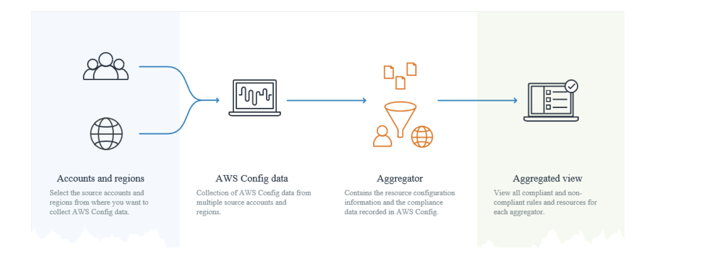

- It helps you to manage , audit and continuously monitor the configuration of your aws resource.
- You can export the config of your resourse as json , same can be exported to s3
- [Getting started](https://docs.aws.amazon.com/config/latest/developerguide/gs-console.html) #hands-on
-
- ## Config - Rules
	- We can maintain compilance of our resource by adding config rules
	- #+BEGIN_WARNING
	  Each rule in config will cost 1$ per month
	  #+END_WARNING
	- [Getting started](https://docs.aws.amazon.com/config/latest/developerguide/evaluate-config.html) #hands-on
-
- ## Config - Automations
	- AWS config sends notification to [[SNS]]
	- Config sends notification on below scenarios #exam-revise
	  collapsed:: true
		- Configuration item change for a resource.
		- Configuration history for a resource was delivered for your account.
		- Configuration snapshot for recorded resources was started and delivered for your account.
		- Compliance state of your resources and whether they are compliant with your rules.
		- Evaluation started for a rule against your resources.
		- AWS Config failed to deliver the notification to your account.
		- Source: https://docs.aws.amazon.com/config/latest/developerguide/notifications-for-AWS-Config.html
			-
-
- ## Config -  Multi account
- 
- source: https://docs.aws.amazon.com/config/latest/developerguide/aggregate-data.html
- Use aggregator to collect data from multiple accounts and regions
-