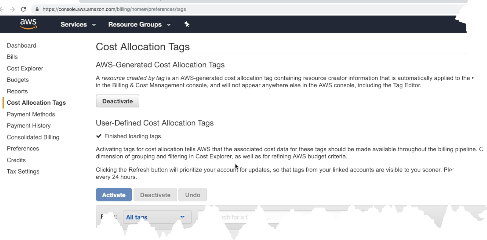

- Tags can be used to track cost
	- 
- Types #exam-revise
	- AWS generated Cost Allocation tags
		- These are autogenerated by AWS
		- Starts with prefix **aws**
		- #+BEGIN_CAUTION
		  Won't be available before resource is active
		  #+END_CAUTION
	- User generated tags
		- We can mark user-generated tags as cost allocation tag, once then we can use that tag to track cost