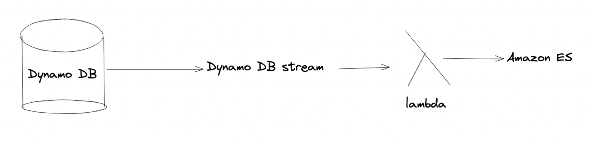
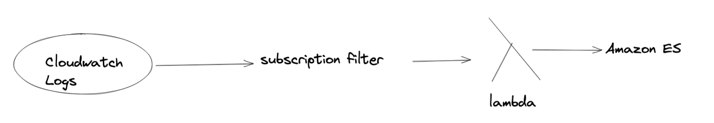
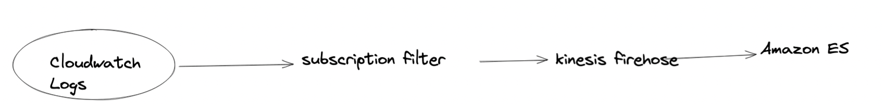

- Amazon ES is managed version of ElasticSearch
- Needs a server and not serverless #exam-revise
- Use cases #exam-revise
	- Analytics (Log, security ..)
	- Indexing
	- Full Text search
- General flow
	- Elastic search -> for search and index
	- Kibana -> for dashboard (alternate to cloudwatch dashboard)
	- Logstash -> for log ingestion (alternate to cloudwatch logs)
-
- Search patterns
	- Dynamodb
	- 
	- Cloudwatch
		- Method 1: (You get data in realtime)
			- 
		- Method 2: (You get data in near realtime due to Kinesis)
			- 
		-
- ---
-