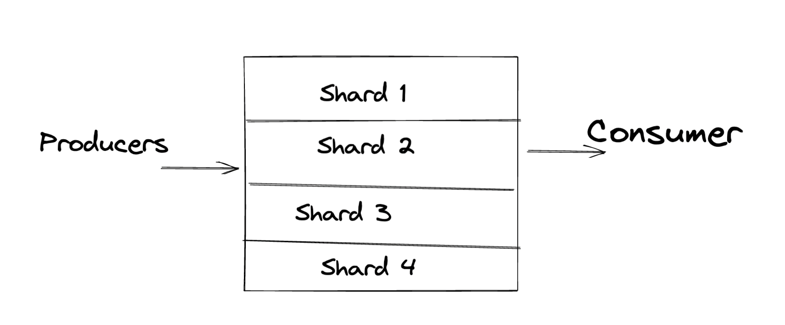

- This one onboards data to Kinesis from multiple inputs like
	- Realtime IoT
	- Metrics and Logs
- Stream are divided into ordered shards (say multiple parts)
- Data retention in Kinesis is ==1 day (default) to 7 days== #exam-revise
- #+BEGIN_CAUTION
  #exam-revise 
  Once data into Kinesis can't be deleted manually , it gets auto deleted based on the retention duration
  #+END_CAUTION
- #+BEGIN_TIP
  #exam-revise
  Single Stream can be used by multiple applications 
  #+END_TIP
- How it looks?
  collapsed:: true
	- Shards are ordered sequence
	- 
- Kinesis Stream Records #exam-revise
	- Contains 3
		- Data Blob -> Data , can be upto 1 MB
		- Record Key -> Used to group shards same Record key = Same shard group
		- Sequence number - > Added by Kinesis post data injection to track sequence of shard
- #+BEGIN_WARNING
  #exam-revise 
  Limitations :
  - Provider can write 1MB/s or 1000 Messages/sec else would result in ==ProvisionedThroughputException==
  -Consumer can read 2 MB/sec per shard
  
  #+END_WARNING