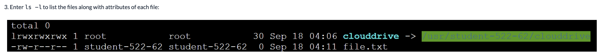

- #+BEGIN_IMPORTANT
  Linux commands are case sensitive
  #+END_IMPORTANT
- Basic commands
  collapsed:: true
	- `echo hello`
	- ```bash
	  echo hello
	  #hello
	  
	  echo hello world
	  #hello world
	  
	  echo -n hello
	  #hello
	  ```
	- `man`
	  collapsed:: true
		- > To get manual page
		- 
		- Anything within `[]` brackets are optional
		- > `F` to scroll one page `B` to scroll backpage
		- > `/` <<search word>> to search any. `N` to find the next match
		-
		-
	- Help
		- > `man --help` or `man -h` or `man - ?` to find the help
	- File
		- Create new file
			- `touch <<filename`
		- To read the file
			- `cat <<filename>>`
		- Pass output of cmd to a file
			- `echo "hi" > <<filename>>` -> This replace all the contents in a file
			- `echo "hi" >> <<filename>>` -> This adds text to the end of the file
		- Copy the file
			- `cp <<filename>> <<destination>>`
		- Move the file
			- `mv <<filename>> <<destination>>`
	- Directories
	  collapsed:: true
		- `pwd` -> To know the current working directory
		- Create directory
			- `mkdir <<directory name` -> creates a directory
		- Delete the directory and files init
			- `rm -r <<directory name>>` -> Deletes the directory and files within it
			- To delete just the directory
				- `rm -d <<directory name`
	- Variables
		- Set variable value `test_var=Hi`
		- To refer variables use $ `echo $test_var`
	- Assign output of a command to variable
		- `current_date=$(date)` -> This stores current date to current_date variable
	-
	-
		-
	-
- Multiline in cmd
  collapsed:: true
	- > use `\` to enter next line than treated as enter in terminal
	- {:height 188, :width 890}
	- The first line of the output (total 0) is how many blocks of storage space are used by all the files listed. The following rows describe the details of each file.
	- The third column, with values root and student-522-62 in the above image, gives the name of the user that owns the file.
	- The fourth column is the name of the group that owns the file, also having the values of root and student-522-62 in the image above. Users can be members of groups as a way of more easily managing multiple users.
	- The first column, for example, lrwxrwxrwx, describes the file type and file permissions.
	          The first character represents the file type. l represents a link, and - represents a regular file.
	          The following nine characters represent the file permissions: the first three describe the permissions of the file owner, the middle three describe the permissions of the file's group, and the final three describe the permissions of all other users. Each triplet can include an r for read permission, a w for write permission, and an x for execute permission. As an example, for file.txt the owner has read and write permissions (rw-), the group has read permission (r--), and other users have read permission (r--). Execute permission allows you to execute a file. For example, you have execute permission for ls because you are allowed to execute the ls command. Otherwise an error message would be printed when you issue the ls command.
	- The fifth column is the size of the file in bytes. clouddrive is 30 bytes and file.txt is 0 bytes.
	- The sixth column, for example, Sep 18 04:06, is the date and time the file was last modified.
	- The file name is given last. In the case of link files, the file that it links to is also given and is displayed with a green background in the image above.
- To print multiline
  collapsed:: true
	- ```bash
	  cat <<EOF
	  First line
	  Second line
	  Third line
	  EOF
	  
	  Output:
	  First line
	  Second line
	  Third line
	  ```
- Replace a text
	- `sed 's/<<from_word>>/<<to_Wrodlinux/' geekfile.txt`