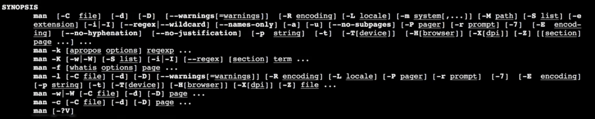

- #+BEGIN_IMPORTANT
  Linux commands are case sensitive
  #+END_IMPORTANT
- Basic commands
	- `echo hello`
	- ```bash
	  echo hello
	  #hello
	  
	  echo hello world
	  #hello world
	  
	  echo -n hello
	  #hello
	  ```
	- `man`
	  collapsed:: true
		- > To get manual page
		- 
		- Anything within `[]` brackets are optional
		- > `F` to scroll one page `B` to scroll backpage
		- > `/` <<search word>> to search any. `N` to find the next match
		-
		-
	- Help
		- > `man --help` or `man -h` or `man - ?` to find the help
	- File
		- Create new file
			- `touch <<filename`
		-
	-