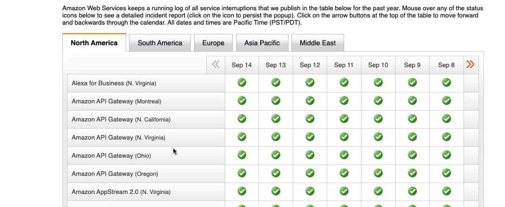

- status.aws.amazon.com -> gives you the health status of all aws service globally
- 
- Personalised Health Dashboard
	- We can use personalised health dashboard to know the status of resources within our AWS account
	- Cloudwatch event -> service name Health can be used to send notification if any alert on our personal dashboard