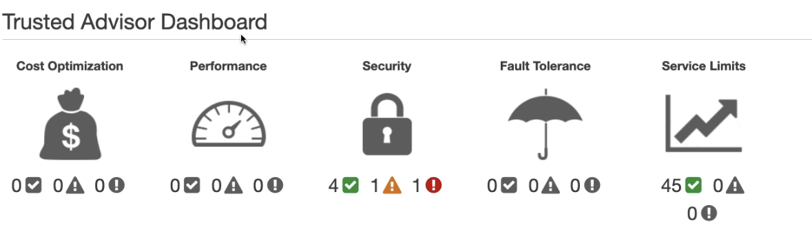

- Used to automate security events and provide recommended actions
- 
- It has both free tier and paid service
	- To get in depth analysis we would require paid service
-
- ### Automations
	- We can get notified using [[CloudWatch events]] . Ensure [[CloudWatch events]] is created in N.viginia
	-